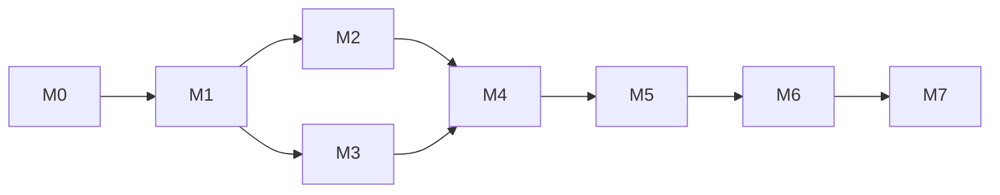

# PLAN — Agentic AML & Regulatory Compliance Guardian (PoC)

| Campo | Valor |
| :--- | :--- |
| Versão | 1.0.0 |
| Status | Aprovado |
| Origem | `INTENT.md` · `SPEC.md` 1.1.0 · `SOUL.md` 1.0.0 · `AGENTS.md` 1.0.0 (todos aprovados em 2026-09-15) |
| Decisões vinculadas | `docs/ADR.md` — ADR-001 a ADR-013 |
| Evidência reutilizada | `scripts/bench_ollama.py` · `reports/benchmark-ollama-2026-09-15-v2.md` |
| Próximos documentos | `TASKS.md` |
| Gate | Aprovado por: marcosjcn94@gmail.com — Data: 2026-09-15 |

Convenção: **MUST** = obrigatório; **MUST NOT** = proibido (igual ao `SPEC.md`).
Este documento **não cria** requisito, meta, norma, limiar ou número de artigo: define **ordem, dependências, entregas e gates de saída**
dos marcos da PoC a partir do que já foi aprovado. Toda entrega aponta para o seu ID de origem. O passo a passo de implementação fica no `TASKS.md`.
Não há datas nem estimativas de esforço: cada marco termina quando o seu gate de saída é atendido.

---

## 1. Estratégia

- **Esqueleto ponta a ponta primeiro.** O M1 liga todos os nós do `AGENTS.md` §1 num fluxo fino e executável. Assim, o risco de integração
  LangGraph + checkpoint SQLite + MCP stdio + LiteLLM/Ollama aparece antes do aprofundamento. Os marcos seguintes aprofundam um eixo por vez
  até os gates do `SPEC.md` §10.
- **Guardrails desde o primeiro fluxo.** P1–P5 do `SOUL.md` §2 valem desde o M1: sanitização real e fail-closed, os quatro detectores críticos
  rodando antes de qualquer proposta de arquivamento, auditoria encadeada por hash e LLM apenas na Investigação.
  Os marcos seguintes aprofundam **cobertura e metas**, nunca a presença do guardrail. Custo e prazo nunca justificam violar P1–P5 (P6).
- **Contratos congelados antes do código de nó.** DT-01 a DT-16, DT-14 e `InvestigationState` (`SPEC.md` §8.2, §9.3) viram schemas no M0.
  Qualquer alteração é Ask First (`SOUL.md` §4).
- **Golden set congelado antes de existir regra.** `data/golden/v1` é gerado e congelado por hash no M0. Regras e limiares só são ajustados com o
  conjunto de desenvolvimento disjunto (`SPEC.md` §8.3).
- **Avaliação contínua.** `scripts/evaluate.py` nasce no M1 e cresce a cada marco; o Avaliador roda ao fim de cada marco a partir do M1 (`AGENTS.md` §6).
  Métrica ainda não implementada é reportada como "não medida", nunca como aprovada.

---

## 2. Mapa de marcos

| Marco | Objetivo | Requisitos principais | Depende de | Gate de saída (resumo) |
| :--- | :--- | :--- | :--- | :--- |
| M0 | Fundação, contratos e dados sintéticos | DT-01 a DT-16, `SPEC.md` §3.2, §8.3 | — | Contratos testados; golden set congelado por hash |
| M1 | Esqueleto ponta a ponta | RF-01 a RF-11 e RF-14 (base), API-01, API-03, API-09, MCP-01 a MCP-04 | M0 | Um alerta `INVESTIGAR` e um `PROPOR_ARQUIVAMENTO` chegam a `DRAFT_READY` via API |
| M2 | Privacidade Zero-Trust | RF-01, RF-02, RNF-05, RNF-08, API-04 (backend), MCP-01 | M1 | Recall de sanitização na meta; canário 0 ocorrências |
| M3 | Triagem determinística e recall crítico | RF-03, RF-05, RNF-01, MCP-02, DT-06, DT-16 | M1 | 0 críticos com `PROPOR_ARQUIVAMENTO`; RNF-01 = 100% |
| M4 | RAG normativo, Revisor e cache | RF-04, RF-06, RF-07, RF-08, RF-14, RNF-02, RNF-09, MCP-03, MCP-04 | M2, M3 | Grounding bruto ≥ 99% e final 0; cache sem PII nem decisão |
| M5 | Resiliência, auditoria e prazos | RF-09, RF-10, RF-11, RNF-06, API-07, API-08 | M4 | Injeção de falha termina em estado válido; API-08 detecta adulteração |
| M6 | Fluxo humano, UI e segurança | RF-12, RF-13, RNF-07, API-02, API-04, API-05, API-06 | M5 | E2E alerta → decisão; 0 achados altos/críticos |
| M7 | Avaliação Go/No-Go | `SPEC.md` §10, RNF-03, RNF-04, RNF-10, `SPEC.md` §11 | M6 | Todos os gates do `SPEC.md` §10 |

- M2 e M3 podem correr em paralelo: um aprofunda o perímetro de privacidade, o outro a triagem, sem código em comum além dos contratos do M0.
- M4 depende de M3 (hipótese de tipologia e `p_investigar` estáveis) e de M2 (o cache semântico é superfície de privacidade coberta pelo canário completo).

---

## 3. Marcos

### M0 — Fundação, contratos e dados sintéticos

- **Objetivo:** repositório executável, contratos tipados e dados sintéticos rastreáveis, antes de qualquer nó.
- **Entregas:**
  - Projeto Python 3.11+ com a stack obrigatória do `SPEC.md` §6; nenhuma dependência da lista proibida.
  - Schemas Pydantic v2 de DT-01 a DT-16, DT-14 com validação de `payload` por `schema_version` e `InvestigationState` (`SPEC.md` §9.3).
  - Arquivos versionados em `config/`: `triage_rules.yaml` (com `rules_version`), `litellm.yaml`, `baseline.yaml`, `feriados.yaml`.
  - `data/mappings/saml_d_to_cc4001.yaml` com tipologia → incisos → crítica e `mapping_version` (`SPEC.md` §3.2); `article_ref` preferenciais e `applicability` são completados no M4.
  - Loader do SAML-D que valida nomes de colunas e rótulos de tipologia e falha com mensagem explícita se divergirem (`SPEC.md` §8.3).
  - Camada brasileira: BRL por taxa fixa sintética, `payment_type` mapeado para DT-02, clientes sintéticos (DT-03) com CPF/CNPJ de DV válido gerados por seed → `data/core_sintetico.sqlite`.
  - Gerador de alertas legado simulado: regras de limiar e contagem em janela móvel por conta remetente; MUST NOT criar alerta com ocorrência > 45 dias antes da seleção (Circ. 3.978/2020, art. 39, parágrafo único — `SPEC.md` §3.1); taxa de falso positivo reportada.
  - Conjunto de desenvolvimento disjunto e `data/golden/v1` (500 alertas: 30 por tipologia crítica = 180, 10 por suspeita não crítica = 110, 210 normais) congelado por hash.
- **Ask First pendente:** inclusão das dependências da stack (pedido único em bloco).
- **Gate de saída:**
  - testes de contrato de todos os DT verdes;
  - loader com coluna divergente falha com mensagem explícita;
  - teste do gerador: nenhum alerta com ocorrência > 45 dias;
  - hash do golden set gravado e disjunção com o conjunto de desenvolvimento verificada;
  - nenhum dado real de cliente ou lista de restrição real.
- **Revisores (`AGENTS.md` §6):** Revisor Python.

### M1 — Esqueleto ponta a ponta

- **Objetivo:** um alerta sintético percorre o fluxo completo do `SPEC.md` §1 até `DRAFT_READY`, com todos os guardrails presentes.
- **Entregas:**
  - Grafo LangGraph com os nós do `AGENTS.md` §1, arestas e envelopes do `AGENTS.md` §5 e checkpoint SQLite após cada nó.
  - Sanitizador funcional (RF-02): regex com validação de DV para CPF/CNPJ, agência/conta, nomes via Presidio + spaCy `pt_core_news_lg`;
    tokens `<TIPO>_<NN>` por ordem de aparição; Vault AES-GCM em memória com `KeyProvider`; fail-closed → `NEEDS_HUMAN`.
  - Servidores MCP-01 a MCP-04 locais via stdio, com timeout 2 s, erro `{error_code, retryable}` e evento `TOOL_CALLED` com hash da entrada (`SPEC.md` §9.2).
  - Triagem inicial: os quatro detectores críticos do RF-03 em forma simples, executados antes de qualquer proposta de arquivamento; `TriageDecision` com `fired_rules`.
  - Cálculo do DT-16 segundo o catálogo `features_version = 1` (`AGENTS.md` §4.3).
  - Investigação com o contrato congelado v1 (`AGENTS.md` §4): instruções, bloco do alerta, schema de geração, expansão e validação reaproveitados de
    `scripts/bench_ollama.py` (linhas citadas no `AGENTS.md` §4), extraídos para o pacote sem quebrar o script; teto de 300 tokens com a regra de remoção F14+;
    pós-processamento determinístico do RF-05.
  - LiteLLM Router com alias de configuração para Ollama `qwen2.5:1.5b` e parâmetros `temperature 0`, `seed 42`, `num_ctx 2048`, `num_predict 60`, `num_thread 8` (ADR-010, ADR-013).
  - Corpus inicial (RF-14 base): Circ. BCB 3.978/2020 e CC BCB 4.001/2020 com chunking por dispositivo, `article_ref` e `text_sha256`, na coleção ChromaDB `norms`,
    com um dos candidatos FastEmbed do `SPEC.md` §6 em caráter provisório.
  - Recuperação (top-k = 8, sem cache), Seleção (preferenciais do mapeamento + RRF, `selection.min_score`), Revisor por SHA-256 e Dossiê por template Jinja2 com `ai_generated_fields`.
  - `prazo_interno` e `prazo_regulatorio_analise` calculados e persistidos (RF-09 base).
  - Auditoria append-only com hash-chain e triggers SQLite contra `UPDATE`/`DELETE` (RF-11 base).
  - API-01, API-03 e API-09, com `Authorization: Bearer` por papel carregado de variável de ambiente (ADR-007).
  - `scripts/evaluate.py` inicial.
- **Gate de saída:**
  - teste E2E: alerta com nível `INVESTIGAR` enviado por API-01 chega a `DRAFT_READY` com ≥ 1 citação verificada;
  - teste E2E: alerta com nível `PROPOR_ARQUIVAMENTO` chega a `DRAFT_READY` com 0 chamadas de modelo (contadas no callback do LiteLLM);
  - canário RNF-05 inicial (prompts capturados, logs, `data/app.sqlite`) sem ocorrências;
  - cadeia de auditoria recalculada válida;
  - latência do fluxo `INVESTIGAR` medida e registrada como informativa no relatório do Avaliador.
- **Revisores:** Revisor Python; Guardião de privacidade e segurança (a mudança toca sanitizador, prompt, Vault e servidores MCP); Avaliador.

### M2 — Privacidade Zero-Trust

- **Objetivo:** levar sanitização, logging e reidentificação às metas do RF-02, RNF-05 e RNF-08.
- **Entregas:**
  - DT-13 gerado em tempo de execução (nunca versionado com documento real ou sintético em claro) e testes Hypothesis: com e sem máscara, DV inválido → `NEEDS_HUMAN`.
  - Sanitização na saída de MCP-01 e MCP-02 antes de chegar a agente; MCP-02 nunca devolve nome, documento ou motivo textual.
  - RF-01 completo: idempotência por `alert_id` (`200`/`409`/`422`) e nenhum payload bruto persistido.
  - Logging estruturado em JSON com `trace_id`, sem payload; mensagens de erro da API sem dado pessoal.
  - Backend da API-04: evento `PII_REVEALED`, `Cache-Control: no-store`, `410` com reconstrução do Vault a partir do sistema de origem (ADR-012).
  - Canário RNF-05 completo — prompts capturados, logs, coleções ChromaDB (`norms` e `semantic_cache`), `data/app.sqlite` e checkpoints — empacotado para rodar
    em toda mudança de sanitizador, logging, prompt, cache ou servidor MCP (`SOUL.md` §4).
- **Gate de saída:**
  - recall ≥ 99% para CPF/CNPJ/conta e ≥ 95% para nomes no DT-13;
  - canário RNF-05 com 0 ocorrências em todos os destinos;
  - testes `200`/`409`/`422` do RF-01 e inspeção do SQLite sem valores brutos.
- **Revisores:** Guardião de privacidade e segurança (obrigatório); Revisor Python; Avaliador.

### M3 — Triagem determinística e recall crítico

- **Objetivo:** triagem versionada que nunca propõe arquivamento de tipologia crítica e reduz o volume enviado à Investigação.
- **Entregas:**
  - `config/triage_rules.yaml` com os quatro detectores críticos do RF-03 — fragmentação, dispersão/concentração em camadas com profundidade ≥ 2,
    depósito em espécie seguido de envio transfronteiriço e acerto em lista de restrição via MCP-02 — mais regras não críticas com motivo legível.
  - Indicadores do DT-16 que dependem da triagem e das tools (F08, F10, F11, F13) calculados a partir de DT-06, MCP-01 e MCP-02.
  - Pós-processamento do RF-05 verificado no golden set: detector crítico disparado, ou hipótese crítica com `ARQUIVAR` → `NEEDS_HUMAN`.
  - Medição de `p_investigar` e da parcela de redução de tokens atribuída à triagem.
- **Ask First pendente:** valores de limiar dos detectores e cada nova `rules_version`.
- **Gate de saída:**
  - 0 alertas de tipologia crítica com nível `PROPOR_ARQUIVAMENTO` no golden set;
  - RNF-01 = 100% com cache desligado;
  - mesma entrada + mesma `rules_version` → mesma `TriageDecision`;
  - 100% das saídas da Investigação válidas no schema ou em `NEEDS_HUMAN`, e 0 evidências com `feature_id` inexistente no dossiê (aceite do RF-05);
  - registro de que os limiares foram ajustados apenas com o conjunto de desenvolvimento.
- **Revisores:** Revisor Python; Avaliador.

### M4 — RAG normativo, Revisor e cache

- **Objetivo:** grounding normativo na meta e redução de tokens medida com e sem cache.
- **Entregas:**
  - Ingestão completa do RF-14: Circ. BCB 3.978/2020, CC BCB 4.001/2020 e Lei 9.613/1998, com `source_url`, `downloaded_at`, `doc_sha256` e `corpus_version`.
  - Revalidação do texto literal de cada dispositivo do `SPEC.md` §3.1 contra o corpus ingerido.
  - Escolha do modelo de embedding entre os candidatos do `SPEC.md` §6 por recall@5 no conjunto de desenvolvimento (ADR-009), registrada em novo ADR.
  - Mapeamento completo: `article_ref` preferenciais e texto curado de `applicability` por par tipologia × `article_ref`; incremento de `mapping_version`.
  - Seleção com RRF entre similaridade vetorial e BM25 e descarte abaixo de `selection.min_score` (RF-06, ADR-013 A).
  - Revisor completo do RF-07, incluindo remoção e listagem de citações rejeitadas e `COS` sem citação verificada → `NEEDS_HUMAN`.
  - Dossiê completo do RF-08: todos os campos do DT-11 e `versions{rules, corpus, mapping, features, prompt, model}`.
  - Cache semântico do RF-04 na coleção `semantic_cache`: chave embedding + `corpus_version`, `cache.threshold` padrão 0,92, invalidação por `corpus_version`,
    desligável por configuração e resultado sempre passando pelo Revisor.
- **Ask First pendente:** novo ADR do modelo de embedding; valor de `selection.min_score`; qualquer valor de `cache.threshold` diferente de 0,92.
- **Gate de saída:**
  - grounding bruto ≥ 99% e 0 citações não verificadas em `DRAFT_READY` (RNF-02);
  - citação com 1 caractere adulterado é rejeitada;
  - dispositivos do `SPEC.md` §3.1 encontrados por `article_ref` com texto conferido; reingestão sem mudança não altera `corpus_version`;
  - troca de `corpus_version` zera acertos; inspeção da coleção de cache sem `alert_id`, recomendação ou token de dado pessoal;
  - snapshot do template e 100% dos dossiês válidos no DT-11;
  - mesma entrada e mesmas versões → mesmo resultado de triagem e revisão (RNF-09);
  - redução de tokens medida com e sem cache, decomposta em parcela da triagem e parcela do cache (`SPEC.md` §3.3).
- **Revisores:** Revisor de RAG; Guardião de privacidade e segurança (o cache é tocado); Avaliador.

### M5 — Resiliência, auditoria e prazos

- **Objetivo:** nenhum alerta perdido ou arquivado por falha, trilha de auditoria verificável e prazos corretos em todas as fronteiras de calendário.
- **Entregas:**
  - Máquina de estados do RF-10 com rejeição `409` de transição fora do diagrama.
  - No máximo 2 retries por nó com backoff exponencial; timeout por nó = 2 × orçamento do nó ou do grupo (`AGENTS.md` §1).
  - Orçamento por alerta: ≤ 2.000 tokens e ≤ 40 s de relógio; excedido → `NEEDS_HUMAN`.
  - Fallback do Router: sem modelo menor validado (ADR-013 B), a falha do primário vai a `NEEDS_HUMAN`; MUST NOT escalar para modelo maior.
  - Retomada pelo último checkpoint sem duplicar evento (`event_key = alert_id + node + attempt`); `NEEDS_HUMAN` preserva a produção parcial e o `failure_reason`.
  - DT-12 com todos os campos do RF-11; API-07 e API-08.
  - RF-09 completo: `config/feriados.yaml`, `dias_restantes`, sinalização `EM_RISCO` com `dias_restantes ≤ 1` e `prazo_comunicacao` como próximo dia útil após `decidido_em`.
- **Gate de saída:**
  - testes de injeção de falha — timeout, JSON inválido, servidor MCP fora e processo morto no meio — terminam em estado válido, sem arquivamento e sem evento duplicado (RNF-06);
  - alteração direta de um evento no arquivo SQLite faz a API-08 apontar o primeiro `seq` inválido;
  - testes de fronteira de prazo: virada de mês, fim de semana e feriado.
- **Revisores:** Revisor Python; Avaliador.

### M6 — Fluxo humano, UI e segurança

- **Objetivo:** fechar o ciclo humano (submissão e aceite) numa UI que só fala com a API, com a superfície de ataque verificada.
- **Entregas:**
  - API-02 com filtros `state` e `em_risco`; API-05; API-06 com `decision ∈ {COMUNICAR, ARQUIVAR, DEVOLVER}` e `justification` ≥ 50 caracteres; `RETURNED → DRAFT_READY`.
  - Nenhum caminho até `APPROVED` sem aceite do `compliance_officer` e nenhuma transmissão a sistema externo (RF-12).
  - UI Streamlit: fila por estado e prazo, detalhe do dossiê mascarado, botão "Reidentificar" (API-04), submissão e decisão; consome apenas a API REST,
    sem cache em disco nem logging de valores reais (RF-13).
  - Teste E2E Playwright do fluxo alerta → decisão.
  - Execução de `bandit`, `semgrep`, `pip-audit` e OWASP ZAP baseline contra a API (RNF-07).
- **Gate de saída:**
  - analista tentando decidir → `403`; officer sem justificativa → `422`;
  - E2E Playwright verde; log da UI sem valores reais;
  - 0 achados altos ou críticos abertos em SAST, dependências e DAST.
- **Revisores:** Guardião de privacidade e segurança; Revisor Python; Avaliador.

### M7 — Avaliação Go/No-Go

- **Objetivo:** decisão Go/No-Go da PoC pelos gates do `SPEC.md` §10, com custo e portabilidade medidos.
- **Entregas:**
  - `scripts/evaluate.py --golden data/golden/v1` completo, gerando `reports/eval-<data>.json` e `.md` com todas as métricas, versões e parâmetros de `config/baseline.yaml`.
  - Benchmark de latência no hardware de referência (`SPEC.md` §3.3): p95, modelo já carregado, apenas alertas `INVESTIGAR`, reaproveitando a metodologia de `scripts/bench_ollama.py`.
  - Custo por alerta pela fórmula do `SPEC.md` §11, com `p_investigar` e tokens medidos no golden set e extrapolação 10x/100x com IBM AMLworld, fora do golden set.
  - RNF-10: a mesma suíte de avaliação executada com um segundo provedor, alterando apenas `config/litellm.yaml`.
- **Ask First pendente:** escolha do segundo provedor do RNF-10; validação de `baseline.tempo_manual_min` e `baseline.tempo_revisao_min` com especialista de compliance (`SPEC.md` §12).
- **Gate de saída (`SPEC.md` §10):**

| Métrica | Gate |
| :--- | :--- |
| Recall crítico (RNF-01) | = 100% |
| Grounding (RNF-02) | bruto ≥ 99% e final 0 |
| Redução de falsos positivos à equipe sênior | ≥ 65% |
| Velocidade | ≥ 3x |
| Redução de tokens | > 70% |
| Latência (RNF-03) | p95 < 20 s |
| Prazo interno | 100% dentro |
| Privacidade (RNF-05) | 0 ocorrências |
| Integridade da auditoria (API-08) | `valid = true` |

- **Go:** todos os gates atendidos. **No-Go** sem exceção se recall crítico, grounding final, privacidade ou integridade falhar.
  Falha em latência, tokens, falsos positivos ou velocidade exige ADR com causa e plano antes de nova rodada.
- **Revisores:** Avaliador; Revisor de RAG se houver ajuste de corpus, Recuperação, Seleção ou cache.

---

## 4. Matriz de rastreabilidade

"Entra" = marco em que o requisito ganha código ou schema; "Aceite" = marco cujo gate verifica o critério de aceite do `SPEC.md`;
"§10" = reconfirmado no gate final do M7.

| ID | Entra | Aceite | §10 |
| :--- | :---: | :---: | :---: |
| RF-01 | M1 | M2 | — |
| RF-02 | M1 | M2 | — |
| RF-03 | M1 | M3 | ✅ |
| RF-04 | M4 | M4 | — |
| RF-05 | M1 | M3 | — |
| RF-06 | M1 | M4 | ✅ |
| RF-07 | M1 | M4 | ✅ |
| RF-08 | M1 | M4 | — |
| RF-09 | M1 | M5 | ✅ |
| RF-10 | M1 | M5 | — |
| RF-11 | M1 | M5 | ✅ |
| RF-12 | M6 | M6 | — |
| RF-13 | M6 | M6 | — |
| RF-14 | M1 | M4 | — |
| RNF-01 | M3 | M3 | ✅ |
| RNF-02 | M4 | M4 | ✅ |
| RNF-03 | M1 | M7 | ✅ |
| RNF-04 | M7 | M7 | — |
| RNF-05 | M1 | M2 | ✅ |
| RNF-06 | M5 | M5 | — |
| RNF-07 | M6 | M6 | — |
| RNF-08 | M2 | M2 | — |
| RNF-09 | M1 | M4 | — |
| RNF-10 | M1 | M7 | — |
| API-01 | M1 | M2 | — |
| API-02 | M6 | M6 | — |
| API-03 | M1 | M6 | — |
| API-04 | M2 | M6 | — |
| API-05 | M6 | M6 | — |
| API-06 | M6 | M6 | — |
| API-07 | M5 | M5 | — |
| API-08 | M5 | M5 | ✅ |
| API-09 | M1 | M1 | — |
| MCP-01 | M1 | M2 | — |
| MCP-02 | M1 | M3 | — |
| MCP-03 | M1 | M4 | — |
| MCP-04 | M1 | M4 | — |
| DT-01 | M0 | M2 | — |
| DT-02 | M0 | M0 | — |
| DT-03 | M0 | M0 | — |
| DT-04 | M0 | M2 | — |
| DT-05 | M0 | M5 | — |
| DT-06 | M0 | M3 | — |
| DT-07 | M0 | M3 | — |
| DT-08 | M0 | M4 | — |
| DT-09 | M0 | M4 | — |
| DT-10 | M0 | M4 | — |
| DT-11 | M0 | M4 | — |
| DT-12 | M0 | M5 | — |
| DT-13 | M0 | M2 | — |
| DT-14 | M0 | M1 | — |
| DT-15 | M0 | M6 | — |
| DT-16 | M0 | M3 | — |

---

## 5. Decisões pendentes (Ask First)

Ask First cobre só decisão estrutural que vira ADR (`SOUL.md` §4). Decisão não estrutural (limiar, `rules_version`, `selection.min_score`,
`cache.threshold` = 0,92) é tomada com evidência do conjunto de desenvolvimento e registrada no `MEMORY.md`, sem bloquear o marco.

| Decisão | Marco | Forma |
| :--- | :--- | :--- |
| Inclusão das dependências da stack do `SPEC.md` §6 | M0 | Aceite do autor (já concedido; novas dependências continuam Ask First) |
| Limiares dos detectores e cada nova `rules_version` | M3 | Decisão com evidência do conjunto de desenvolvimento, registrada no `MEMORY.md` |
| Modelo de embedding (recall@5, ADR-009) | M4 | Novo ADR antes do código |
| `selection.min_score` e qualquer `cache.threshold` diferente de 0,92 | M4 | Decisão com evidência do conjunto de desenvolvimento, registrada no `MEMORY.md` |
| Segundo provedor do RNF-10 | M7 | Aceite do autor; decisão estrutural → ADR |
| Validação de `tempo_manual_min` e `tempo_revisao_min` | M7 | Especialista de compliance (`SPEC.md` §12) |
| Push | Todos | Aceite do autor (`SOUL.md` §4); commit e branch são automáticos |

---

## 6. Riscos

| Risco | Marco em que aparece | Resposta já aprovada |
| :--- | :--- | :--- |
| Overhead real do grafo, MCP e auditoria sobre os 15,0 s estimados no ADR-013 | M1 (medido), M7 (gate) | Reduzir contexto ou modelo (ADR-010); nunca relaxar a meta sem novo ADR (`SPEC.md` §5) |
| Colunas ou rótulos do SAML-D divergentes do mapeamento | M0 | Loader falha com mensagem explícita (`SPEC.md` §8.3) |
| Recall de nomes pt-BR abaixo de 95% | M2 | Tratado antes de RAG e UI por ser gate No-Go de privacidade |
| Prompt acima de 300 tokens (média medida de 319 com contrapartes calibradas) | M1 | Remoção determinística de F14+; se ainda exceder → `NEEDS_HUMAN` (`AGENTS.md` §4.1) |
| Ausência de modelo menor para fallback aumenta `NEEDS_HUMAN` e pesa na métrica de falsos positivos | M5, M7 | Aceito no ADR-013 B; falha em FP exige ADR com causa e plano (`SPEC.md` §10) |
| Contaminação do golden set por ajuste após ver resultados | M3 em diante | Ajuste só no conjunto de desenvolvimento; falha no golden exige ADR com causa e plano antes de nova rodada; este plano não pré-autoriza novo golden set |
| Viés do mapeamento SAML-D → CC 4.001/2020 | M0, M4 | Mapeamento versionado e explícito (`SPEC.md` §12) |
| Licença CC BY-NC-SA 4.0 do SAML-D | Todos | PoC restrita a uso não comercial (`SPEC.md` §12) |

---

## 7. Definição de pronto de marco

Um marco só termina quando todos os itens abaixo estão cumpridos:

- Gate de saída do marco atendido com evidência executável (teste focado ou relatório), citando os IDs tocados.
- Revisores do `AGENTS.md` §6 aplicáveis executados e achados altos resolvidos.
- Canário RNF-05 executado se o marco tocou sanitizador, logging, prompt, cache ou servidor MCP.
- Relatório do Avaliador gerado (M1 em diante), com métricas não implementadas marcadas como "não medida".
- `rules_version`, `prompt_version`, `mapping_version` ou `features_version` incrementadas quando o artefato correspondente mudou (RNF-09).
- `MEMORY.md` atualizado com aprendizados, bugs persistentes e decisões tomadas no caminho.
- Decisão estrutural tomada no marco registrada em ADR novo.
- Commit apenas com aceite do autor.

---

## 8. Governança deste documento

- **Precedência:** `SOUL.md` §5. Este documento não pode afrouxar nenhum limite do `SPEC.md`, `SOUL.md` ou `AGENTS.md`; em conflito, vale a regra mais restritiva e o conflito é registrado em ADR.
- **Mudança:** alterar ordem, escopo, dependência ou gate de marco incrementa a versão deste documento; decisão estrutural gera ADR novo antes do código.
- **Derivação:** o `TASKS.md` decompõe cada marco em fatias verticais, uma por sessão de implementação, cada uma com os IDs de requisito e o teste focado correspondente (`AGENTS.md` §6).
- **Revisão:** reler este documento sempre que `SPEC.md`, `SOUL.md` ou `AGENTS.md` mudarem de versão.

## Gate
Status: aprovado pelo autor em 2026-09-15. `TASKS.md` herda estes marcos, dependências e gates como ponto de partida.
