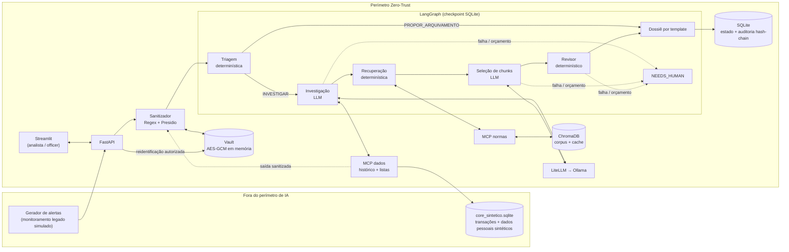

# SPEC — Agentic AML & Regulatory Compliance Guardian (PoC)

| Campo | Valor |
| :--- | :--- |
| Versão | 1.0.0 |
| Status | Aprovado |
| Origem | `INTENT.md` (aprovado em 2026-09-15) |
| Decisões vinculadas | `docs/ADR.md` — ADR-001 a ADR-012 |
| Próximos documentos | `SOUL.md` (limites comportamentais) → `AGENTS.md` (papéis e tools por agente) → `PLAN.md` → `TASKS.md` |
| Gate técnico | Aprovado por: marcosjcn94@gmail.com — Data: 2026-09-15 |

Convenção: **MUST** = obrigatório; **MUST NOT** = proibido; **SHOULD** = recomendado, desvio exige justificativa em ADR.
Cada requisito tem ID rastreável (`RF`, `RNF`, `DT`, `API`, `MCP`) e critério de aceite verificável.

---

## 1. Escopo da fatia vertical

**Fluxo único da PoC:** um alerta sintético entra → é sanitizado → passa pela triagem determinística → (se complexo) é investigado
por agentes → recebe citações normativas verificadas → vira minuta de dossiê → é submetido pelo analista → recebe decisão do
Compliance Officer. Cada passo gera evento na trilha de auditoria.

**Princípio de fronteira (ADR-006):** LLM só onde há julgamento — síntese investigativa e seleção de trechos normativos.
Sanitização, triagem, verificação de citação, montagem do dossiê, controle de prazo e auditoria são código determinístico.

### Dentro do escopo
- Processamento de um alerta por vez via API (lote apenas no script de avaliação).
- API REST (FastAPI) e UI mínima do analista e do Compliance Officer (Streamlit) — ADR-007.
- Servidores MCP locais para histórico transacional sintético, listas de restrição sintéticas e corpus normativo.
- Envelope A2A definido e usado entre agentes; transporte em processo (mesmo runtime LangGraph).
- Avaliação offline sobre golden set sintético (seção 10).

### Fora do escopo (herdado de `INTENT.md` + técnico)
- Bloquear saldos ou travar operações em tempo real.
- Transmitir qualquer dado ao COAF (nem mesmo em homologação); o status final é `APPROVED`, não "enviado".
- Enviar dado pessoal não sanitizado a modelo, RAG, cache ou log.
- Dados reais de clientes; listas PEP/CEIS/CNEP reais.
- Substituir a decisão humana de comunicar ou arquivar — inclusive o arquivamento proposto pela triagem.
- Multi-tenant, SSO corporativo, alta disponibilidade, fila distribuída (ver seção 11).
- Transporte A2A em rede entre processos distintos.

---

## 2. Terminologia

| Termo | Definição |
| :--- | :--- |
| Alerta | Janela de transações de uma conta remetente sinalizada pelo monitoramento legado simulado (DT-01). |
| Seleção | Momento em que o alerta é criado; marco inicial dos prazos (seção 3.1). |
| Tipologia | Rótulo do SAML-D (17 suspeitas, 11 normais); mapeada a incisos da CC 4.001/2020 (seção 3.2). |
| Tipologia crítica | Tipologia suspeita com meta de recall 100% (seção 3.2). |
| Token sintético | Substituto de dado pessoal no formato `<TIPO>_<NN>` (ex.: `CPF_01`, `CONTA_03`, `NOME_02`), atribuído por ordem de aparição dentro do alerta. |
| Vault | Mapa token → valor real, cifrado em memória, nunca persistido (ADR-012). |
| Nível de triagem | Resultado da triagem: `PROPOR_ARQUIVAMENTO` (sem LLM) ou `INVESTIGAR` (agentes). |
| Citação | Referência a um `chunk_id` do corpus normativo com o trecho literal. |
| Citação verificada | Citação cujo trecho, após normalização (Unicode NFC, espaços colapsados, trim), tem SHA-256 igual ao `text_sha256` do chunk no corpus vigente. |
| Veredito do Revisor | Resultado determinístico da verificação de todas as citações de uma minuta (DT-10). |
| Dossiê | Minuta de Comunicação de Operação Suspeita (`COS`) ou de arquivamento justificado (`ARQUIVAMENTO`). |
| Submissão | Ato do analista que envia o dossiê revisado ao Compliance Officer. |
| Aceite | Decisão digital do Compliance Officer: `COMUNICAR`, `ARQUIVAR` ou `DEVOLVER`. |
| Estado do alerta | Posição na máquina de estados (RF-10). |
| Hash-chain | Encadeamento `hash_n = SHA-256(hash_{n-1} ‖ json_canônico(evento_n))` da trilha de auditoria. |

---

## 3. Resolução das perguntas abertas do INTENT

### 3.1 Prazos regulatórios (verificados na fonte oficial)

Fontes: Circular BCB 3.978/2020 — `https://www.bcb.gov.br/api/conteudo/app/normativos/exibenormativo?p1=Circular&p2=3978`;
Lei 9.613/1998 (compilada) — `https://www.planalto.gov.br/ccivil_03/leis/l9613compilado.htm`.

| Regra | Dispositivo | Uso na PoC |
| :--- | :--- | :--- |
| Seleção em até 45 dias da ocorrência da operação | Circ. 3.978/2020, art. 39, parágrafo único | Gerador de alertas (DT-01) MUST NOT criar alerta com ocorrência > 45 dias antes da seleção. |
| Análise em até 45 dias da seleção | Circ. 3.978/2020, art. 43, §1º | `prazo_regulatorio_analise = selecao_em + 45 dias` (RF-09). |
| Análise formalizada em dossiê, independentemente de comunicação | Circ. 3.978/2020, art. 43, §2º | Todo alerta termina em dossiê, inclusive arquivamento (RF-08). |
| Decisão fundamentada nas informações do dossiê e registrada de forma detalhada | Circ. 3.978/2020, art. 48, §1º | Aceite exige justificativa textual (API-06). |
| Comunicação ao COAF até o dia útil seguinte à decisão | Circ. 3.978/2020, art. 48, §2º | `prazo_comunicacao = próximo dia útil após decidido_em` exibido na UI; nenhuma transmissão real. |
| Comunicação em 24 horas | Lei 9.613/1998, art. 11, II | Exibida como referência normativa no dossiê `COS`; convive com o art. 48, §2º. |
| Guarda do dossiê por 10 anos | Circ. 3.978/2020, art. 67, IV | Premissa de produção; na PoC (dados sintéticos) retenção é local e ilimitada. |

- **Prazo interno da PoC (meta de produto, não norma):** minuta em `DRAFT_READY` em até **5 dias corridos** da seleção.
  O KPI "zero autuações por prazo" é aferido pelo proxy: 100% dos alertas do golden set com `draft_ready_em ≤ selecao_em + 5 dias`
  e 0 alertas com `prazo_regulatorio_analise` vencido.
- O texto literal de cada dispositivo acima MUST ser revalidado contra o corpus ingerido (RF-14) antes de aparecer em dossiê.

### 3.2 Tipologias críticas

Mapeamento do projeto (não é texto da norma) entre as tipologias suspeitas do SAML-D e a Carta Circular BCB 4.001/2020
(`https://www.bcb.gov.br/api/conteudo/app/normativos/exibenormativo?p1=Carta%20Circular&p2=4001`).
Critério de criticidade: indício de financiamento do terrorismo (art. 1º, IX), fragmentação para evitar controles (art. 1º, I e IV)
ou ocultação em camadas.

| Tipologia SAML-D (suspeita) | Enquadramento CC 4.001/2020 (art. 1º) | Crítica |
| :--- | :--- | :---: |
| Deposit-Send | IX (financiamento do terrorismo) | Sim |
| Structuring | I (espécie — fragmentação de depósitos/saques, alíneas d, e, k), IV | Sim |
| Smurfing | I (alíneas d, e, f, l, m), IV | Sim |
| Layered Fan-In | IV (movimentação de contas) | Sim |
| Layered Fan-Out | IV | Sim |
| Stacked Bipartite | IV | Sim |
| Fan-Out, Fan-In, Cycle, Bipartite, Scatter-Gather, Gather-Scatter | IV | Não |
| Over-Invoicing | X (atividades internacionais) | Não |
| Cash Withdrawal | I | Não |
| Single Large Transaction | IV | Não |
| Behavioural Change 1, Behavioural Change 2 | IV | Não |

- Tipologias não críticas têm recall medido e reportado, sem meta de 100%.
- A CC 4.001/2020 não menciona PIX. Na camada brasileira, PIX é apenas um valor sintético de `payment_type`, enquadrado no inciso IV por decisão do projeto.
- O mapeamento é versionado em `data/mappings/saml_d_to_cc4001.yaml` (`mapping_version` gravado em cada dossiê).

### 3.3 Demais perguntas

| Pergunta | Resposta |
| :--- | :--- |
| Meta > 70% de redução de tokens é atingível? | Medida, não presumida: `reducao_tokens = 1 − tokens_pipeline / tokens_baseline`, onde `tokens_baseline` = mesmo golden set com triagem e cache desligados (100% via agentes). Reportada decomposta em parcela da triagem e parcela do cache. Meta permanece > 70% como gate Go/No-Go (seção 10). |
| Baseline dos KPIs −65% e 3x | Processo manual **simulado** (ADR-005): o monitoramento legado encaminha 100% dos alertas à equipe sênior; tempo manual por dossiê é parâmetro `baseline.tempo_manual_min` em `config/baseline.yaml`. Fórmulas na seção 10. |
| Hardware da latência | Notebook de referência: Intel Core i7-1255U (10 núcleos), 15,7 GB RAM, Intel Iris Xe, sem GPU dedicada — inferência CPU-only. p95, modelo já carregado, apenas alertas com nível `INVESTIGAR`. |
| Interface do analista na PoC? | Sim: Streamlit mínima consumindo exclusivamente a API REST (RF-13). |

---

## 4. Requisitos funcionais

### RF-01 — Ingestão de alerta
- MUST validar o payload contra o schema DT-01; inválido → `422` sem persistir nada.
- MUST ser idempotente por `alert_id`: mesmo payload → `200` com o estado atual; payload diferente com mesmo `alert_id` → `409`.
- MUST registrar `selecao_em` (UTC) e evento `ALERT_RECEIVED`.
- MUST NOT persistir o payload bruto (contém dado pessoal); só a versão sanitizada (RF-02).
- **Aceite:** teste com payload repetido, payload conflitante e payload inválido retorna `200/409/422`; inspeção do SQLite não encontra valores brutos.

### RF-02 — Sanitização de dado pessoal (Zero-Trust, ADR-003/ADR-012)
- MUST detectar CPF e CNPJ (com e sem máscara, validando dígitos verificadores), agência/conta e nomes de pessoa (Presidio + spaCy `pt_core_news_lg`).
- MUST substituir cada valor por token sintético determinístico por ordem de aparição no alerta; mesmo valor → mesmo token no mesmo alerta.
- MUST guardar o mapeamento apenas no Vault (AES-GCM em memória, chave via `KeyProvider`).
- MUST ser fail-closed: qualquer exceção ou detecção ambígua (ex.: sequência de 11 dígitos com DV inválido) → estado `NEEDS_HUMAN`, sem chamar LLM.
- MUST ser aplicado também na saída de todo servidor MCP de dados antes de o conteúdo chegar a um agente.
- **Aceite:** recall ≥ 99% para CPF/CNPJ/conta e ≥ 95% para nomes no conjunto de teste de sanitização (DT-13); teste canário RNF-05 sem ocorrências.

### RF-03 — Triagem determinística
- MUST aplicar regras versionadas (`config/triage_rules.yaml`, `rules_version`) sobre o alerta sanitizado.
- MUST executar detectores de padrão crítico antes de qualquer proposta de arquivamento: fragmentação (N transações abaixo de limiar em janela), dispersão/concentração em camadas (fan-in/fan-out com profundidade ≥ 2), depósito em espécie seguido de envio transfronteiriço, e acerto em lista de restrição.
- MUST NOT atribuir `PROPOR_ARQUIVAMENTO` quando qualquer detector crítico disparar.
- MUST registrar `TriageDecision` com regras disparadas e motivo legível.
- `PROPOR_ARQUIVAMENTO` gera dossiê de arquivamento por template (RF-08) sem LLM; a decisão final continua humana (RF-12).
- **Aceite:** 0 alertas de tipologia crítica com nível `PROPOR_ARQUIVAMENTO` no golden set; mesma entrada + mesma `rules_version` → mesma saída.

### RF-04 — Cache semântico normativo (ADR-004/ADR-009)
- MUST cobrir apenas consultas normativas (consulta sanitizada → `chunk_id`s selecionados).
- MUST NOT armazenar decisões, recomendações ou evidências de alertas.
- Chave: embedding da consulta + `corpus_version`; acerto se similaridade de cosseno ≥ `cache.threshold` (padrão 0,92).
- MUST invalidar todas as entradas quando `corpus_version` mudar.
- Resultado vindo do cache MUST passar pelo Revisor (RF-07) como qualquer outro.
- MUST ser desligável por configuração; a medição de recall e grounding do golden set roda com cache desligado, e a medição de tokens roda com e sem.
- **Aceite:** teste de troca de `corpus_version` zera acertos; teste de inspeção da coleção de cache não contém `alert_id`, recomendação ou token de dado pessoal.

### RF-05 — Investigação (nó LLM)
- MUST receber apenas o alerta sanitizado, a `TriageDecision` e resultados das tools MCP (MCP-01, MCP-02).
- MUST devolver JSON válido no schema DT-07 (saída estruturada); JSON inválido após os retries → `NEEDS_HUMAN`.
- Toda evidência MUST referenciar `transaction_id` ou resultado de tool existente; referência inexistente é descartada deterministicamente e registrada.
- Pós-processamento determinístico: se a triagem disparou detector crítico ou `typology_hypothesis` é crítica e a recomendação é `ARQUIVAR`, o alerta vai para `NEEDS_HUMAN`.
- **Aceite:** 100% das saídas do golden set validam no schema ou terminam em `NEEDS_HUMAN`; 0 evidências com referência inexistente no dossiê.

### RF-06 — Pesquisa normativa
- Recuperação determinística: consulta montada por template a partir da tipologia hipotética e dos incisos mapeados (seção 3.2), top-k = 8 via MCP-03.
- Nó LLM seleciona no máximo 3 `chunk_id` entre os recuperados e escreve justificativa de aplicabilidade (≤ 300 caracteres).
- MUST NOT gerar, parafrasear ou completar texto normativo; o trecho citado é sempre copiado do chunk via MCP-04.
- `chunk_id` fora do conjunto recuperado é descartado e contabilizado como citação não verificada na métrica bruta.
- **Aceite:** grounding bruto ≥ 99% (RNF-02) no golden set.

### RF-07 — Revisor determinístico
- MUST verificar cada citação: `chunk_id` existe no `corpus_version` vigente, trecho normalizado tem SHA-256 igual a `text_sha256`.
- Citação não verificada MUST ser removida da minuta e listada em `ReviewVerdict.rejected_citations`.
- Minuta `COS` sem nenhuma citação verificada → `NEEDS_HUMAN`.
- MUST NOT usar LLM.
- **Aceite:** 0 citações não verificadas em dossiês `DRAFT_READY`; teste com citação adulterada (1 caractere) é rejeitada.

### RF-08 — Montagem do dossiê
- MUST gerar o dossiê por template (Jinja2) a partir de DT-07, DT-10 e DT-12; nenhum texto livre do dossiê vem do LLM além de `rationale` (DT-07) e `applicability` (DT-09), ambos marcados como "gerado por IA".
- Campos obrigatórios: DT-11. Campo obrigatório ausente → `NEEDS_HUMAN`.
- Tipos: `COS` (recomendação `COMUNICAR`) ou `ARQUIVAMENTO` (triagem ou recomendação `ARQUIVAR`); `INCONCLUSIVO` → `NEEDS_HUMAN`.
- **Aceite:** teste de snapshot do template; validação de schema DT-11 em 100% dos dossiês.

### RF-09 — Controle de prazo
- MUST calcular e persistir `prazo_interno` (seleção + 5 dias corridos) e `prazo_regulatorio_analise` (seleção + 45 dias, art. 43, §1º).
- MUST calcular `prazo_comunicacao` (próximo dia útil após `decidido_em`) quando o aceite for `COMUNICAR`; calendário de feriados nacionais em `config/feriados.yaml`.
- MUST expor `dias_restantes` e sinalizar `EM_RISCO` quando `dias_restantes ≤ 1` para o prazo interno.
- **Aceite:** testes unitários de fronteira (virada de mês, fim de semana, feriado).

### RF-10 — Máquina de estados e recuperação de falha (ADR-011)

```
RECEIVED → SANITIZED → TRIAGED ─┬─ PROPOR_ARQUIVAMENTO ────────────────┐
                                └─ INVESTIGATING → RESEARCHING → REVIEWING ─┤
                                                                            ▼
                                                                      DRAFT_READY → SUBMITTED ─┬→ APPROVED (COMUNICAR | ARQUIVAR)
                                                                                               └→ RETURNED → DRAFT_READY
qualquer estado anterior a DRAFT_READY ──(falha / orçamento esgotado / fail-closed)──→ NEEDS_HUMAN
```

- Transições fora do diagrama MUST ser rejeitadas (`409`).
- MUST salvar checkpoint LangGraph (SQLite) após cada nó; reinício retoma do último checkpoint sem duplicar eventos de auditoria (idempotência por `event_key = alert_id + node + attempt`).
- Retries: máximo 2 por nó, com backoff exponencial; timeout por nó = 2 × orçamento do nó (RNF-03).
- Orçamento por alerta: ≤ 2.000 tokens (entrada + saída somados) e ≤ 40 s de relógio; excedido → `NEEDS_HUMAN`.
- Fallback de modelo via LiteLLM: modelo primário → modelo menor → `NEEDS_HUMAN`. MUST NOT escalar para modelo maior.
- `NEEDS_HUMAN` MUST preservar tudo o que já foi produzido e o motivo (`failure_reason`).
- **Aceite:** testes de injeção de falha (timeout, JSON inválido, servidor MCP fora, processo morto no meio) terminam em estado válido, sem arquivamento e sem evento duplicado.

### RF-11 — Trilha de auditoria imutável (ADR-008)
- Cada evento (DT-12) MUST conter: `alert_id`, `event_type`, `actor` (sistema/papel), `state_from`, `state_to`, `model_id` (quando houver), `prompt_sha256`, `rules_version`, `corpus_version`, `mapping_version`, `prompt_version`, `tokens_in`, `tokens_out`, `latency_ms`, `prev_hash`, `hash`.
- MUST ser append-only: triggers SQLite abortam `UPDATE` e `DELETE` na tabela de auditoria.
- MUST NOT conter dado pessoal nem conteúdo bruto de prompt (apenas hash).
- Verificação de integridade (API-08) recalcula a cadeia inteira.
- **Aceite:** teste que altera um evento diretamente no arquivo SQLite faz API-08 apontar o primeiro `seq` inválido.

### RF-12 — Submissão e aceite
- Papel `analista` submete dossiê `DRAFT_READY` (API-05); papel `compliance_officer` decide (API-06).
- Aceite MUST exigir `decision ∈ {COMUNICAR, ARQUIVAR, DEVOLVER}` e `justification` com ≥ 50 caracteres (art. 48, §1º).
- MUST NOT existir caminho que leve a `APPROVED` sem aceite do papel `compliance_officer`.
- MUST NOT transmitir dados a sistema externo.
- **Aceite:** testes de autorização (analista tentando decidir → `403`; officer sem justificativa → `422`).

### RF-13 — UI do analista e do Compliance Officer
- Telas: fila por estado e prazo; detalhe do dossiê mascarado; botão "Reidentificar" (papel `analista` ou `compliance_officer`); submissão; decisão.
- Reidentificação MUST chamar API-04, gerar evento `PII_REVEALED` e exibir valores reais só na sessão corrente (sem cache em disco, sem logging).
- A UI MUST consumir apenas a API REST; MUST NOT acessar SQLite, ChromaDB ou Vault diretamente.
- **Aceite:** teste E2E (Playwright) do fluxo alerta → decisão; verificação de que o log da UI não contém valores reais.

### RF-14 — Ingestão do corpus normativo
- MUST baixar os textos das fontes primárias (inicialmente Circ. BCB 3.978/2020 e CC BCB 4.001/2020; Lei 9.613/1998 como complemento) e registrar `source_url`, `downloaded_at`, `doc_sha256`.
- Chunking por dispositivo (artigo / parágrafo / inciso / alínea) com `article_ref` estruturado (ex.: `Circ3978/art43/p1`) e `text_sha256` do trecho normalizado.
- Qualquer mudança de `doc_sha256` gera nova `corpus_version` e invalida o cache (RF-04).
- **Aceite:** os dispositivos da seção 3.1 são encontrados por `article_ref` e o texto confere com a fonte; reingestão sem mudança não altera `corpus_version`.

---

## 5. Requisitos não-funcionais

| ID | Requisito | Meta | Medição |
| :--- | :--- | :--- | :--- |
| RNF-01 | Recall de tipologias críticas | 100% | `alertas críticos com desfecho ∈ {COS recomendado, NEEDS_HUMAN} / alertas críticos` no golden set, cache desligado |
| RNF-02 | Grounding normativo | Bruto ≥ 99%; final 0 não verificadas | Bruto = citações propostas pelo nó LLM que passam no Revisor / total proposto; final = inspeção de `DRAFT_READY` |
| RNF-03 | Latência por minuta | p95 < 20 s | Script de benchmark no hardware de referência (seção 3.3); orçamento abaixo |
| RNF-04 | Custo por alerta | < R$ 0,005 (R$ 0 local) | Fórmula da seção 11 com tokens medidos |
| RNF-05 | Privacidade | 0 ocorrências | Teste canário: valores sintéticos marcados inseridos em alertas são procurados em prompts capturados pelo callback do LiteLLM, logs, coleções ChromaDB, cache e SQLite |
| RNF-06 | Resiliência | 0 alertas perdidos ou arquivados por falha | Testes de injeção de falha (RF-10) |
| RNF-07 | Segurança de código e API | 0 achados altos/críticos abertos | `bandit`, `semgrep` (SAST), `pip-audit` (dependências), OWASP ZAP baseline contra a API (DAST) |
| RNF-08 | Observabilidade sem dado pessoal | 100% dos logs estruturados em JSON com `trace_id`, sem payload | Teste canário RNF-05 cobre logs |
| RNF-09 | Reprodutibilidade | Mesmo resultado de triagem e revisão para mesma entrada e versões | `temperature = 0`, `seed` fixo, versões gravadas em DT-12 |
| RNF-10 | Portabilidade de provedor | Mesma suíte de avaliação roda trocando só `config/litellm.yaml` | Execução com segundo provedor configurado (seção 11) |

### Orçamento de latência (RNF-03), p95, alerta com nível `INVESTIGAR`

| Etapa | Tipo | Orçamento |
| :--- | :--- | ---: |
| Sanitização + triagem + chamadas MCP de dados | Determinístico | ≤ 1,5 s |
| Embedding da consulta + busca vetorial (+ cache) | Determinístico | ≤ 0,5 s |
| Investigação — SLM ~3B quantizado Q4, ≤ 800 tokens de entrada, ≤ 150 de saída | LLM | ≤ 12 s |
| Seleção de chunks — SLM ~1,5B quantizado Q4, saída só IDs + justificativa curta | LLM | ≤ 3 s |
| Revisor + template + auditoria | Determinístico | ≤ 1 s |
| Margem | — | 2 s |

- **Gate antes do `PLAN.md`:** benchmark de tokens/s (processamento de prompt e geração) dos modelos candidatos no hardware de referência.
  Se o orçamento não fechar, a ação é reduzir contexto ou modelo (ADR-010), nunca relaxar a meta sem novo ADR.

---

## 6. Stack

### Obrigatória
| Camada | Tecnologia |
| :--- | :--- |
| Linguagem | Python 3.11+ |
| Orquestração | LangGraph + `langgraph-checkpoint-sqlite` |
| Gateway de modelos | LiteLLM (Router com fallbacks) |
| Runtime local de modelos | Ollama (família Qwen 2.5; nome do modelo é configuração — ADR-010) |
| Ferramentas de dados | MCP (SDK Python oficial `mcp`), servidores locais via stdio |
| Sanitização | Regex com validação de DV + Microsoft Presidio + spaCy `pt_core_news_lg` |
| Embeddings | FastEmbed, modelo multilíngue (candidatos: `paraphrase-multilingual-MiniLM-L12-v2`, `multilingual-e5-small`; escolha por recall@5 no corpus — ADR-009) |
| Base vetorial e cache | ChromaDB persistente local |
| Persistência transacional e auditoria | SQLite (WAL) |
| Cifra do Vault | `cryptography` (AES-GCM) |
| API | FastAPI + Pydantic v2 (OpenAPI gerado) |
| UI | Streamlit |
| Templates | Jinja2 |
| Testes | pytest, Hypothesis (sanitização), Playwright (E2E) |
| Segurança | bandit, semgrep, pip-audit, OWASP ZAP baseline |

### Proibida
- SDKs proprietários de nuvem ou de provedores de modelo importados diretamente (`openai`, `anthropic`, `boto3`, `google-cloud-*`, `azure-*`).
- Chamada de modelo fora do LiteLLM; acesso de agente a dados fora de MCP.
- Dados reais de clientes ou listas de restrição reais.
- Logging de payload bruto, prompt completo ou resposta completa de modelo.
- Persistência do Vault ou da chave em disco.

---

## 7. Arquitetura



- Nós LLM: apenas `Investigação` e `Seleção de chunks`. Todos os demais são código determinístico (ADR-006).
- Todo nó escreve evento de auditoria; toda mensagem entre nós usa o envelope A2A (DT-14).

---

## 8. Arquitetura de dados

### 8.1 Armazenamento

| Local | Conteúdo | Dado pessoal |
| :--- | :--- | :--- |
| `data/core_sintetico.sqlite` | Transações e clientes sintéticos (simula sistema de origem) | Sim (sintético, tratado como real) |
| `data/app.sqlite` | Alertas sanitizados, decisões, dossiês, aprovações, auditoria, checkpoints | Não (apenas tokens) |
| `data/chroma/` coleção `norms` | Chunks normativos + embeddings | Não |
| `data/chroma/` coleção `semantic_cache` | Consulta sanitizada → `chunk_id`s | Não |
| Memória do processo da API | Vault (mapa token → valor, cifrado) | Sim, cifrado, nunca persistido |

- O Vault é reconstruível: tokens são determinísticos por ordem de aparição, então reprocessar a sanitização do alerta a partir do sistema de origem recria o mesmo mapa (ADR-012).

### 8.2 Entidades

| ID | Entidade | Campos principais | Classificação |
| :--- | :--- | :--- | :--- |
| DT-01 | `Alert` (entrada) | `alert_id` (UUID), `source_rule_id`, `selected_at`, `sender_account`, `sender_customer{name, cpf_cnpj}`, `transactions[]` (DT-02), `occurrence_window{start,end}` | Contém dado pessoal — só em trânsito |
| DT-02 | `Transaction` | `transaction_id`, `timestamp`, `amount_brl` (decimal), `payment_type` (`PIX`,`TED`,`ESPECIE_DEPOSITO`,`ESPECIE_SAQUE`,`CARTAO`,`TRANSFERENCIA_INTERNACIONAL`), `sender_account`, `receiver_account`, `sender_location`, `receiver_location`, `currency_sent`, `currency_received` | Contas = dado pessoal |
| DT-03 | `SyntheticCustomer` | `customer_id`, `name`, `cpf_cnpj`, `accounts[]`, `segment`, `restriction_flags` | Dado pessoal sintético (apenas `core_sintetico`) |
| DT-04 | `SanitizedAlert` | Mesmos campos de DT-01 com tokens, + `pii_token_count`, `sanitizer_version` | Sem dado pessoal |
| DT-05 | `AlertRecord` | `alert_id`, `state`, `triage_level`, `selected_at`, `prazo_interno`, `prazo_regulatorio_analise`, `failure_reason`, `created_at`, `updated_at` | Sem dado pessoal |
| DT-06 | `TriageDecision` | `alert_id`, `level`, `fired_rules[]{rule_id, description, critical}`, `rules_version` | Sem dado pessoal |
| DT-07 | `InvestigationOutput` | `typology_hypothesis` (enum: 17 suspeitas + `NENHUMA`), `confidence` (0–1), `recommendation` (`COMUNICAR`,`ARQUIVAR`,`INCONCLUSIVO`), `evidence[]{evidence_id, source (transaction|tool), ref, description}`, `rationale` (≤ 600 caracteres) | Sem dado pessoal |
| DT-08 | `NormChunk` | `chunk_id`, `doc_id`, `article_ref`, `text`, `text_sha256`, `corpus_version`, `source_url` | Público |
| DT-09 | `Citation` | `chunk_id`, `article_ref`, `quoted_text`, `applicability` (≤ 300 caracteres) | Público |
| DT-10 | `ReviewVerdict` | `verified_citations[]`, `rejected_citations[]{chunk_id, reason}`, `grounding_raw_ratio` | Sem dado pessoal |
| DT-11 | `Dossier` | `dossier_id`, `alert_id`, `type` (`COS`,`ARQUIVAMENTO`), `summary`, `typology`, `cc4001_incisos[]`, `evidence[]`, `citations[]` (só verificadas), `recommendation`, `ai_generated_fields[]`, `deadlines{selecao_em, prazo_interno, prazo_regulatorio_analise}`, `versions{rules, corpus, mapping, prompt, model}`, `status` | Sem dado pessoal (tokens) |
| DT-12 | `AuditEvent` | Campos do RF-11 + `seq`, `event_key`, `occurred_at` | Sem dado pessoal |
| DT-13 | `SanitizationTestCase` | `text`, `expected_entities[]{type, start, end}` | Dado pessoal sintético |
| DT-14 | `A2AEnvelope` | `message_id`, `alert_id`, `trace_id`, `from_node`, `to_node`, `type` (`TASK`,`RESULT`,`ERROR`), `schema_version`, `payload`, `created_at` | Sem dado pessoal |
| DT-15 | `Approval` | `alert_id`, `decision`, `justification`, `decided_by_role`, `decided_at`, `prazo_comunicacao` | Sem dado pessoal |

### 8.3 Dados de origem (ADR-005)
- **Transações rotuladas:** SAML-D (CC BY-NC-SA 4.0). Colunas esperadas pelo artigo de origem: `Time`, `Date`, `Sender_account`, `Receiver_account`, `Amount`, `Payment_currency`, `Received_currency`, `Sender_bank_location`, `Receiver_bank_location`, `Payment_type`, `Is_laundering`/`Is_Suspicious`, `Laundering_type`/`Type`.
  O loader MUST validar nomes de colunas e rótulos de tipologia no arquivo baixado e falhar com mensagem explícita se divergirem do mapeamento.
- **Camada brasileira:** conversão para BRL com taxa fixa sintética configurada; `payment_type` mapeado para DT-02; clientes sintéticos com CPF/CNPJ de DV válido gerados com seed.
- **Gerador de alertas (monitoramento legado simulado):** regras de limiar e contagem aplicadas por conta remetente em janela móvel; produz alertas com taxa de falso positivo na faixa do INTENT (90–95%), reportada no relatório de avaliação.
- **Golden set (`data/golden/v1`):** 500 alertas estratificados — 30 por tipologia crítica (180), 10 por suspeita não crítica (110), 210 normais cobrindo as 11 tipologias normais. Congelado por hash; MUST NOT ser usado para ajustar regras de triagem (ajuste usa conjunto de desenvolvimento disjunto).
- **Escala FinOps:** IBM AMLworld apenas para teste de volume (seção 11), fora do golden set.

---

## 9. Contratos

### 9.1 API REST (FastAPI)

Autenticação: header `Authorization: Bearer <token>`; tokens por papel (`analista`, `compliance_officer`, `sistema`) carregados de variável de ambiente, nunca versionados (ADR-007).
Erros: corpo `{"error": {"code": "<CODIGO>", "message": "<texto>", "trace_id": "<uuid>"}}`; mensagens MUST NOT conter dado pessoal.

| ID | Método e rota | Papel | Sucesso | Erros |
| :--- | :--- | :--- | :--- | :--- |
| API-01 | `POST /alerts` | sistema | `202` `{alert_id, state}` | 401, 403, 409, 422 |
| API-02 | `GET /alerts?state=&em_risco=` | analista, officer | `200` lista de DT-05 | 401, 403 |
| API-03 | `GET /alerts/{alert_id}` e `GET /dossiers/{alert_id}` | analista, officer | `200` DT-05 / DT-11 (mascarado) | 401, 403, 404 |
| API-04 | `POST /dossiers/{alert_id}/reidentify` | analista, officer | `200` `{tokens: {"CPF_01": "<valor>"}}`, `Cache-Control: no-store` | 401, 403, 404, 410 (Vault indisponível → reconstruir) |
| API-05 | `POST /dossiers/{alert_id}/submit` | analista | `200` DT-05 | 401, 403, 404, 409 |
| API-06 | `POST /dossiers/{alert_id}/approval` | compliance_officer | `200` DT-15 | 401, 403, 404, 409, 422 |
| API-07 | `GET /audit/{alert_id}` | officer | `200` lista de DT-12 | 401, 403, 404 |
| API-08 | `GET /audit/verify` | officer | `200` `{valid, events_checked, first_invalid_seq}` | 401, 403 |
| API-09 | `GET /health` | público | `200` `{status, ollama, chroma, sqlite, corpus_version}` | 503 |

Exemplo API-01 (dados **sintéticos**; na documentação o documento aparece como token `CPF_01` — os testes de sanitização geram CPFs com DV válido em tempo de execução, nunca versionados):

```json
{
  "alert_id": "8f5c2a1e-3b7d-4c9a-9e21-6a0f4d2b7c11",
  "source_rule_id": "LEG-ESPECIE-FRAG-01",
  "selected_at": "2026-09-15T13:00:00Z",
  "sender_account": "0001-0012345-6",
  "sender_customer": {"name": "Cliente Sintético Um", "cpf_cnpj": "CPF_01"},
  "occurrence_window": {"start": "2026-09-08T00:00:00Z", "end": "2026-09-14T23:59:59Z"},
  "transactions": [
    {"transaction_id": "tx-0001", "timestamp": "2026-09-09T10:12:00Z", "amount_brl": "9800.00",
     "payment_type": "ESPECIE_DEPOSITO", "sender_account": "0001-0012345-6", "receiver_account": "0001-0012345-6",
     "sender_location": "BR", "receiver_location": "BR", "currency_sent": "BRL", "currency_received": "BRL"}
  ]
}
```

Exemplo API-06:

```json
{"decision": "COMUNICAR", "justification": "Depósitos em espécie fragmentados abaixo do limiar interno em cinco dias úteis, sem capacidade financeira compatível registrada no dossiê."}
```

### 9.2 Ferramentas MCP (apenas schemas; uso por agente fica no `AGENTS.md`)

| ID | Tool | Entrada | Saída | Regras |
| :--- | :--- | :--- | :--- | :--- |
| MCP-01 | `get_customer_history` | `{alert_id, account_token, window_days (≤ 180)}` | `{transactions[] (DT-02 sanitizado), aggregates{count, total_brl, by_payment_type}}` | Resolve token via Vault dentro do perímetro; saída passa pelo sanitizador |
| MCP-02 | `check_restriction_lists` | `{alert_id, subject_token}` | `{pep: bool, ceis: bool, cnep: bool, list_version}` | Nunca retorna nome, documento ou motivo textual da lista |
| MCP-03 | `search_norms` | `{query, top_k (≤ 8), corpus_version}` | `{results[]{chunk_id, article_ref, score}}` | Consulta MUST estar sanitizada; sem texto no retorno |
| MCP-04 | `get_norm_passage` | `{chunk_id, corpus_version}` | DT-08 | `404` lógico se `chunk_id` não pertencer à versão |

Todas as tools: timeout 2 s, erro estruturado `{error_code, retryable}`, evento de auditoria `TOOL_CALLED` com hash da entrada.

### 9.3 Estado do grafo e envelope A2A

`InvestigationState` (Pydantic, persistido no checkpoint): `alert_id`, `trace_id`, `state`, `sanitized_alert` (DT-04),
`triage` (DT-06), `investigation` (DT-07 | null), `retrieved_chunk_ids[]`, `citations[]` (DT-09), `review` (DT-10 | null),
`dossier` (DT-11 | null), `budget{tokens_used, started_at}`, `attempts{node: int}`, `failure_reason`.

Mensagens entre nós usam DT-14; `payload` MUST validar contra o schema do tipo declarado em `schema_version`.
Na PoC o transporte é em processo; o contrato é o mesmo que um transporte A2A em rede usaria (seção 11).

---

## 10. Avaliação e gates Go/No-Go

| Métrica | Fórmula | Gate |
| :--- | :--- | :--- |
| Recall crítico | RNF-01 | = 100% |
| Grounding | RNF-02 | bruto ≥ 99% e final 0 |
| Redução de falsos positivos à equipe sênior | `1 − FP_pipeline / FP_baseline`; `FP_baseline` = alertas normais do golden set (legado encaminha 100%); `FP_pipeline` = alertas normais com dossiê `COS` ou `NEEDS_HUMAN` | ≥ 65% |
| Velocidade | `tempo_manual_min / (latência_média_min + baseline.tempo_revisao_min)`, parâmetros de `config/baseline.yaml` gravados no relatório | ≥ 3x |
| Redução de tokens | Seção 3.3 | > 70% |
| Latência | RNF-03 | p95 < 20 s |
| Prazo interno | Seção 3.1 | 100% dentro |
| Privacidade | RNF-05 | 0 ocorrências |
| Integridade da auditoria | API-08 após a execução | `valid = true` |

- Script único `scripts/evaluate.py --golden data/golden/v1` gera `reports/eval-<data>.json` e `.md` com todas as métricas, versões e parâmetros.
- **Go:** todos os gates atendidos. **No-Go:** qualquer gate de recall, grounding final, privacidade ou integridade falhando — sem exceção.
  Falha em latência, tokens, FP ou velocidade exige ADR com causa e plano antes de nova rodada.

---

## 11. Evolução PoC → produção (referência, não requisito)

| Dimensão | PoC | 10x | 100x | Gatilho de reavaliação |
| :--- | :--- | :--- | :--- | :--- |
| Entrada de alertas | API síncrona, um processo | Fila com consumidores | Fila particionada por conta | Fila acumulada acima do prazo interno |
| Orquestração | LangGraph em processo, checkpoint SQLite | Workers sem estado, checkpoint em Postgres | Workers autoescaláveis | CPU sustentada > 80% |
| Inferência | Ollama local via LiteLLM | Gateway corporativo de LLM via LiteLLM | Gateway com roteamento por custo e cota | p95 > meta ou custo > meta |
| Vetores e cache | ChromaDB local | Base vetorial gerenciada ou pgvector | Idem, com réplicas de leitura | recall@5 ou latência de busca fora da meta |
| Chaves | `KeyProvider` local | KMS da nuvem escolhida | HSM / KMS com rotação | Exigência de segurança da instituição |
| Auditoria | SQLite hash-chain | Postgres append-only + âncora periódica do hash | Armazenamento WORM | Volume de eventos / exigência de auditoria externa |
| Transporte A2A | Em processo | Mensageria interna com DT-14 | Idem, entre serviços independentes | Agentes com ciclos de deploy distintos |

- **Custo por alerta:** `custo = p_investigar × (tok_in × preço_in + tok_out × preço_out) + custo_embedding`,
  com `p_investigar` e tokens medidos no golden set e extrapolados com IBM AMLworld para 10x e 100x; preços são parâmetros do provedor escolhido no momento da decisão.
- **Troca de provedor:** alterar apenas `config/litellm.yaml` e rodar `scripts/evaluate.py`; os mesmos gates da seção 10 decidem a troca.

---

## 12. Premissas

- Inferência CPU-only no hardware de referência; o orçamento de latência depende do gate de benchmark (seção 5).
- O mapeamento SAML-D → CC 4.001/2020 é decisão do projeto e pode conter viés; está versionado e explícito.
- A licença CC BY-NC-SA 4.0 do SAML-D restringe a PoC a uso não comercial; em produção a base é substituída por dados reais mascarados da instituição.
- Os KPIs de −65% e 3x são medidos contra baseline simulado; `tempo_manual_min` e `tempo_revisao_min` são premissas do autor, sem fonte externa, e devem ser validados com especialista de compliance antes de uso em business case.
- Limites comportamentais dos agentes e fronteiras operacionais (Always / Ask First / Never) são definidos em `SOUL.md`; papéis, prompts e tools por agente em `AGENTS.md`.
