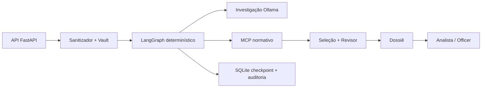

# Arquitetura

```mermaid
flowchart LR
  A[API FastAPI] --> B[Sanitizador + Vault]
  B --> C[LangGraph determinístico]
  C --> D[Investigação Ollama]
  C --> E[MCP normativo]
  E --> F[Seleção + Revisor]
  F --> G[Dossiê]
  G --> H[Analista / Officer]
  C --> I[SQLite checkpoint + auditoria]
```

A API é o único perímetro. A UI consome REST; não acessa banco, Chroma ou Vault.
Decisões estruturais estão em `docs/ADR.md` e contratos em `SPEC.md`.
