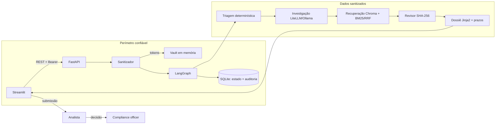

# Arquitetura

## Limites de confiança

- O payload cru termina no Sanitizador. LLM, RAG, cache, dossiê persistido e logs recebem somente tokens.
- O Vault não é persistido. Reidentificação exige papel autorizado, fica na sessão e gera auditoria.
- Dados externos entram apenas pelos MCP-01–04; chamadas de modelo passam apenas pelo LiteLLM.
- O SLM propõe tipologia, confiança, recomendação e IDs de feature. Ele não escreve o dossiê nem cita norma.
- Qualquer ambiguidade, timeout, violação de budget ou citação inválida segue fail-closed para
  `NEEDS_HUMAN`.
- `APPROVED` só é alcançado pelo `compliance_officer`; não existe integração de envio ou bloqueio.

## Fluxo de dados

1. API valida DT-01, sanitiza e cria DT-04.
2. Triagem produz DT-06; arquivamento proposto pula o modelo, mas ainda gera minuta humana.
3. Investigação recebe DT-04/DT-06 sanitizados e produz DT-07 usando somente DT-16.
4. Recuperação/seleção escolhem até três chunks; o Revisor valida texto e versão por hash.
5. Template monta DT-11 e calcula prazos. Cada nó salva checkpoint e DT-12 idempotente.
6. Analista revisa/submete; officer decide com DT-15 e justificativa obrigatória.

Contratos canônicos: `SPEC.md` e `AGENTS.md`. Decisões centrais: ADR-003/012 (privacidade/Vault), ADR-006/013
(LLM único), ADR-008 (auditoria), ADR-009/016 (RAG) e ADR-017 (portabilidade local).
